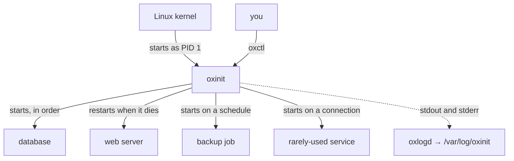
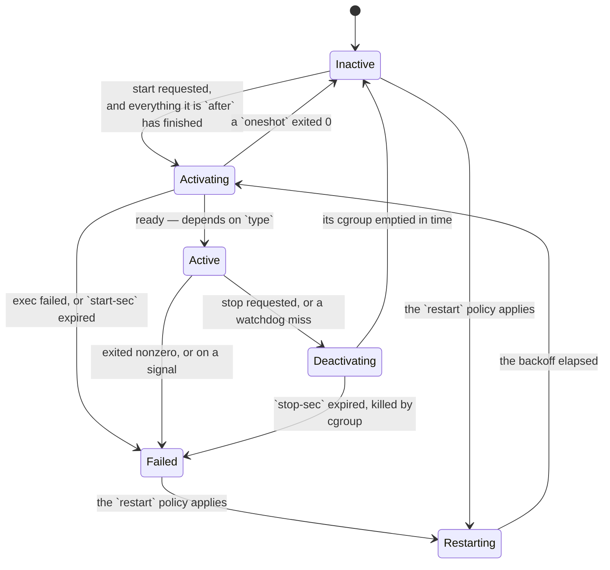

# oxinit

A service manager and PID 1 for Linux, written in Rust.

[](#license)
[](ROADMAP.md)
[](https://github.com/youhide/oxinit/actions/workflows/ci.yml)

**Pre-alpha. Nothing is stable.** See [ROADMAP.md](ROADMAP.md) for what works.

## What this is, in one picture

An init system is the first program the kernel starts. It is process number 1,
and it is responsible for every other process on the machine: starting them in
the right order, restarting them when they die, and stopping them cleanly when
the machine goes down. If it exits, the kernel panics and the machine is gone.



`oxctl` and `oxlogd` are separate programs that talk to oxinit over a socket.
That is deliberate: a bug in the log writer kills the log writer, and a bug in
PID 1 kills the machine.

## Try it

You need [Docker](https://docs.docker.com/get-started/get-docker/) and a Rust
toolchain. Two commands:

```bash
cargo xtask fetch --arch x86_64   # a kernel and a busybox, into target/
cargo xtask demo                  # build the image and run it
```

Or pull the image, which tracks `main` and needs no toolchain at all:

```bash
docker run --rm --name oxinit-demo -p 8080:8080 ghcr.io/youhide/oxinit:demo
```

oxinit boots as PID 1 inside the container and starts a handful of small
services. You will see it resolve them in order, report each one, and then sit
there supervising.

The first few lines are oxinit saying what the container runtime will not let
it do — mount `/run`, set the hostname, write to the cgroup filesystem. That is
not a failure and not noise: a supervisor that pretended those worked would be
lying about the machine it is on.

**Look at what it is running.** In a second terminal:

```bash
docker exec oxinit-demo /bin/oxctl list
```

**Read a service's log.** `counter` writes a line every two seconds, into its
own file rather than onto the console:

```bash
docker exec oxinit-demo /bin/oxctl logs counter
```

**Watch a service start because you asked for something.** Nothing is
listening on port 8080 — no process, that is, though the port is bound. The
request is what starts the service:

```bash
curl localhost:8080
```

**Stop it the way a real system would.** `docker stop` sends `SIGTERM`, which
is a request to shut down, not a kill:

```bash
docker stop oxinit-demo
```

oxinit stops every service in the reverse of the order it started them, waits
for each to actually be gone, and exits `0`. Most container images have to be
killed after a ten-second grace period; that shows up as exit code 137.

The units the demo runs are in [demo/](demo/), one small file each, and they
are meant to be read. The image is 4.6 MB — statically linked against musl,
`FROM scratch`, no base image and no shared libraries.

## Why

Every init system in production use is written in C: systemd, OpenRC, runit,
s6, dinit. The Rust attempts either stalled — rustysd is unmaintained — or
explicitly declined to be PID 1, as initd did.

PID 1 is the process that cannot fail. If it exits, the kernel panics. It is the
parent of every service on the machine, it owns the cgroup hierarchy, it holds
the file descriptors for socket activation, and it determines the order in which
everything shuts down. There is no supervisor above it to restart it.

That is a large blast radius for a language where a bounds error is a memory
error. The correctness properties Rust enforces at compile time are worth more
in PID 1 than anywhere else in the system.

## Design principles

1. **PID 1 stays small.** Supervision only. The CLI, log shipping, and device
   management are separate processes talking over a unix socket.
2. **No panic in PID 1.** `panic = "unwind"`, never `abort` — an abort in PID 1
   is a kernel panic. Every event-loop handler is wrapped in `catch_unwind`. The
   `oxinit` crate denies `unwrap`, `expect`, `panic`, and slice indexing. If the
   loop cannot continue, it spawns `/bin/sh` on the console. It exits in exactly
   one place: the end of an ordered shutdown in a container, where the container
   lives only as long as its PID 1 does.
3. **Unsafe is quarantined.** Syscalls go through `rustix`. Whatever `unsafe`
   remains lives in one module, with a `// SAFETY:` comment per block stating
   the invariant.
4. **Synchronous.** One epoll loop, one thread, no async runtime in PID 1.
5. **Declarative units.** TOML. No shell, no scripting, no runtime
   interpolation beyond a small documented set of specifiers.

## Units

```toml
# /etc/oxinit/units/sshd.toml

[unit]
description = "OpenSSH daemon"
after       = ["network-online"]
requires    = ["network-online"]

[service]
type         = "notify"         # simple | forking | oneshot | notify
exec         = "/usr/sbin/sshd -D"
restart      = "on-failure"     # no | always | on-failure | on-abnormal
restart-sec  = "5s"
stop-sec     = "20s"
watchdog-sec = "30s"
user         = "sshd"

[resources]
memory-max = "256M"
tasks-max  = 512
```

`requires` and `after` are both declared, and neither implies the other. "A
needs B running" and "A must start after B" are different statements, and
conflating them makes both impossible to express precisely.

`after` means the unit is not started until every unit it names has finished
activating — for a `notify` service, until `READY=1` actually arrives. Boot is
a queue drained by the event loop, not a loop that issues starts in order.

Every key is specified in [docs/UNIT_FORMAT.md](docs/UNIT_FORMAT.md). That
document is the specification, not a description of the parser.

A socket unit binds an address before anything starts, and names the service
those descriptors belong to:

```toml
# /etc/oxinit/units/sshd-socket.toml

[unit]
description = "SSH socket"

[socket]
listen  = ["0.0.0.0:22", "[::]:22"]
service = "sshd"
```

Nothing runs until something connects, and a restart does not refuse
connections — the listening socket outlives the process serving them, so they
queue in the kernel.

A timer unit starts a service on a schedule, and names it the same way:

```toml
# /etc/oxinit/units/backup-timer.toml

[unit]
description = "Nightly backup"

[timer]
service     = "backup"
on-calendar = "03:30"
```

`on-boot` and `interval` cover the monotonic cases — first firing, then every
firing after it, measured from the previous one. The calendar vocabulary is
deliberately closed: `hourly`, `daily`, `weekly`, `HH:MM`, `HH:MM:SS`, in UTC.
It is not a cron expression and will not become one. Calendar deadlines are
armed absolutely on a `CLOCK_REALTIME` timerfd, so "at 03:30" survives the
clock being corrected under it. A firing that arrives
while the service is still running is skipped rather than queued, and a failed
run does not stop the schedule.

## What oxinit does with a service

Every service moves through the same states, and the edges are what the
`restart` policy and the readiness `type` decide between.



"Ready" is the interesting one, and it is what `type` selects:

| `type`    | Becomes `Active` when                                          |
|-----------|-----------------------------------------------------------------|
| `simple`  | `exec` succeeded. No more accurate than that.                    |
| `oneshot` | The process exited with status 0 — and it goes `Inactive`, not `Active`. |
| `notify`  | The service sent `READY=1` on the notify socket.                 |
| `forking` | The initial process exited and the cgroup still has something in it. |

Backoff doubles per consecutive failure and resets once the service has stayed
up longer than its own current delay — without that, a service that crashes
once a day eventually takes hours to come back.

## oxctl

`oxctl` talks to PID 1 over `/run/oxinit/control.sock`. It is a separate
process: a bug in the CLI kills the CLI.

```
$ oxctl list
banner       service   inactive      Boot banner
console      service   inactive      Console shell
default      target    active        Default target
echo         service   inactive      Socket-activated echo service
echo-socket  socket    active        Echo socket
limited      service   active        Runs under a memory and task cap
probe        service   active        sd_notify probe
```

```
$ oxctl status probe
probe (service)
  description  sd_notify probe
  state        active
  pid          11
  status       probe up
  memory       94208 bytes
  tasks        1
```

`status` is what the service last sent as `STATUS=` over `sd_notify`. Memory
and tasks are read from `memory.current` and `pids.current` in the service's
cgroup, on demand — nothing is polled.

`start`, `stop`, `restart` and `reload` do what they say. Every answer is
immediate and says what was *asked for*, not what has finished: a stop ends
when the unit's cgroup empties, and the one socket that has to stay responsive
does not wait on the slowest thing on the machine.

## Logs

A service declaring `output = "log"` writes into a pipe rather than onto the
console, and `oxlogd` turns that into `/var/log/oxinit/<unit>.log`:

```
$ oxctl logs chatty
1786287692.803983 chatty-out
1786287692.812454 chatty-err
1786287692.812548 chatty-last
```

`stdout` and `stderr` share the pipe, so the order the service wrote them in
survives. The timestamp is seconds and microseconds since the epoch, padded so
the files sort as text — rendering it as a date is the reader's job, and not
having a calendar in a log writer is worth more than pretty output. Rotation
is by size, because bounded disk per unit is the property that matters.

**PID 1 reads none of it.** It makes the pipe, gives the write end to the
child, and passes the read end to `oxlogd` over a unix socket. A service
writing a megabyte a second cannot make PID 1 do work, and a bug in a log
writer kills a log writer.

oxinit keeps its own copy of every read end, which is what makes an `oxlogd`
restart invisible: the pipes are never closed, the services writing into them
notice nothing, and the replacement is handed every descriptor again when it
connects.

`oxctl logs` reads the file directly rather than asking PID 1 for it. The
control socket has to stay responsive, and bulk data is what would stop it
being.

## Shutdown

`SIGTERM` stops every unit in the reverse of its start order, waits for each
cgroup to empty, then syncs, remounts `/` read-only and calls `reboot(2)`.

| Signal    | Action                                            |
|-----------|---------------------------------------------------|
| `SIGTERM` | Ordered shutdown, then power off.                 |
| `SIGINT`  | Ordered shutdown, then reboot. Ctrl-Alt-Del.      |
| `SIGPWR`  | Ordered shutdown, then power off.                 |
| `SIGUSR1` | Ordered shutdown, then halt without cutting power.|
| `SIGUSR2` | Report every unit's state. Changes nothing.       |

Shutdown is a *state* the supervisor is in, not a routine that runs to
completion: every unit is asked to stop, the ordinary event loop keeps running,
and each event is also a chance to notice that the last one has gone. A
blocking routine would have to re-implement the reaper, the timers and the
cgroup notifications it is waiting on, during the one part of the boot where
getting it wrong strands the machine.

## Current state

Milestones 0 through 14 are done, and the roadmap is closed. oxinit boots under QEMU and runs as a
container's PID 1.

| | |
|---|---|
| **M0** | Mounts, console, `signalfd`, reaping. Never exits. |
| **M1** | TOML units, dependency graph, Kahn ordering, cycles refused at load. |
| **M2** | State machine, restart policy with backoff, `sd_notify`, watchdog. |
| **M3** | cgroup v2: placement between fork and exec, `[resources]`, `cgroup.kill`, privilege drop. |
| **M4** | Socket activation: `LISTEN_FDS`, `LISTEN_PID`, `LISTEN_FDNAMES`. |
| **M5** | Ordered shutdown, the signal table, the control socket, `oxctl`. |
| **M6** | Containers, and a console with a controlling terminal. |
| **M7** | Logs: a pipe per service, `oxlogd`, rotation, `oxctl logs`. |
| **M8** | Timer units: `on-boot`, `interval`, and a closed calendar vocabulary. |
| **M9** | aarch64 as a tested target, not an assumed one. Both boot the same suite. |
| **M10** | A real distribution userspace, with dynamically linked services. |
| **M11** | `after`, `requires` and `conflicts` enforced; `start-sec` bounds activation. |
| **M12** | CI: every suite above, on every push. |
| **M13** | Coverage for seven behaviours the milestones claimed and nothing re-ran. |
| **M14** | Calendar schedules on the wall clock; datagram sockets; the list closed. |
| **M15** | The documents' invariants enforced by the build, not by discipline. |
| **M16** | A demo, a released binary, and a README that starts at the beginning. |

One `epoll` loop multiplexes the signalfd, the timerfd, the notify socket, the
control socket, every socket unit's listening descriptor and every service
cgroup's `cgroup.events`. One thread. No async runtime.

Nothing is scheduled after M16. [ROADMAP.md](ROADMAP.md) has the breakdown —
what each milestone was verified against, what was deferred out of it, and
which remaining ideas are deliberately not being taken.

Every `unsafe` block in the project lives in one file, and that is a property
of the build rather than of anyone's discipline: `oxinit` denies `unsafe_code`
with a single module relaxing it, and every crate that should contain none
carries `forbid`. CI also builds on the declared MSRV and checks the dependency
tree for advisories, because both were promises nothing was keeping.

## Running it

Requires a Rust toolchain with the musl target, `qemu-system-x86_64`, `cpio`,
and a kernel image.

```bash
cargo xtask boot
```

This builds a static binary for `x86_64-unknown-linux-musl`, packs it into a
single-file cpio initramfs, and boots it:

```bash
qemu-system-x86_64 -kernel target/vmlinuz-x86_64 \
  -initrd target/oxinit-x86_64.cpio.gz -nographic -append "console=ttyS0"
```

Edit to boot takes a few seconds. `Ctrl-A X` exits QEMU. Setup details are in
[CONTRIBUTING.md](CONTRIBUTING.md).

Two suites assert on that boot rather than asking you to watch it:

```bash
cargo xtask fetch --arch x86_64    # a kernel and a busybox, into target/
cargo xtask test-boot --arch all   # boots x86_64 and aarch64, matches the log
cargo xtask container              # runs it in Docker, checks the exit code
cargo xtask test-distro            # boots a real Alpine userspace
```

All four run in CI on every push, along with `fmt`, `clippy` against both musl
targets, and the host tests.

The library crates test on any host, with no VM and no kernel:

```bash
cargo test -p oxinit-unit -p oxinit-graph -p oxinit-service
```

That split is the point of the workspace. `oxinit-unit`, `oxinit-graph` and
`oxinit-service` have no OS dependency at all, and the parser, the dependency
semantics and the restart policy are where the logic errors are.

## In a container

oxinit works as a container's PID 1. That job is reaping orphans, forwarding
signals, and supervising more than one process — which is most of what a
service manager already does, and the reason `tini` and `dumb-init` exist. The
difference is that oxinit supervises: restart policy, readiness, ordering, and
a stop that is ordered rather than a broadcast `SIGKILL`.

The image is the binary, the units, and whatever the services need:

```dockerfile
FROM scratch
COPY oxinit /init
COPY units/ /etc/oxinit/units/
COPY myservice /usr/bin/myservice
ENTRYPOINT ["/init"]
```

```bash
cargo xtask container --privileged
```

builds exactly that from this repository's own test units, runs it, and asserts
on the log and on the exit code.

**`docker stop` is an ordered shutdown.** `SIGTERM` stops every unit in the
reverse of its start order, and oxinit then exits: `0` for a clean stop, `133`
— systemd's convention, honoured by podman — where a machine would have
rebooted. Exiting is the whole contract in a container, since the container is
up for exactly as long as its PID 1 is. A supervisor that stopped everything
and stayed running is a container the runtime has to `SIGKILL` ten seconds
later, which is the exit code 137 you have seen.

**The runtime's environment is left alone.** Whatever it already mounted is
skipped rather than re-mounted or reported, and the stdio it exec'd oxinit with
is kept rather than redirected onto `/dev/console` — which is what a container
runtime reads its logs from.

**`[resources]` needs a writable cgroupfs.** By default a runtime mounts
`/sys/fs/cgroup` read-only, and oxinit says so once and carries on without
cgroups: no per-service limits, no `type = "forking"` readiness, and
`cgroup.kill` falls back to signalling the one pid it knows. A unit that
declared a limit oxinit cannot apply fails rather than running uncapped — the
unit asked to be capped, and running it uncapped is not a smaller version of
that. With `--privileged`, or under Kubernetes with the equivalent security
context, the hierarchy works and the limits land.

Note what those limits mean there: the runtime has already capped the whole
container, and `[resources]` divides that budget between the units inside it.
It cannot raise the container's own ceiling.

## Non-goals

oxinit does not, and will not:

- Resolve DNS.
- Implement an NTP client.
- Manage network configuration.
- Run containers. It runs *inside* one, as PID 1; it does not start one.
- Boot the machine — it is not a bootloader, and it does not `switch_root`.
  On a real machine oxinit is what a distribution's initramfs hands over to;
  in a container and in `test-distro` it is the initramfs.
- Manage logins or sessions.

It also will **not** aim for compatibility with systemd unit files. Supporting a
subset of `.service` means adopting a specification that is defined by another
project's implementation rather than by a document, and the subset you implement
is never the one your distribution actually uses. Units are TOML, specified
here, and that is the whole surface.

### Linux only

Not incidentally — the mechanisms oxinit is built on have no portable
equivalent:

| Job | Mechanism | Elsewhere |
|---|---|---|
| Track a service's processes | cgroup v2 | jails/rctl on FreeBSD; a different model |
| Signals as event loop input | `signalfd` | `kqueue` + `EVFILT_SIGNAL` |
| Multiplexing | `epoll` | `kqueue` |
| Deadlines | `timerfd` | `EVFILT_TIMER` |
| Sender identity on a socket | `SO_PASSCRED` / `SCM_CREDENTIALS` | `LOCAL_PEERCRED` / `SCM_CREDS` |
| Boot filesystems | devtmpfs, procfs, sysfs | devfs, no sysfs |

`cgroup.kill` and the `populated` key of `cgroup.events` are what make
`type = "forking"` tractable at all, and they have no direct analogue.

macOS is not a question of effort: `launchd` is PID 1, SIP prevents replacing
it, and there is no interface to substitute an init.

A FreeBSD port is possible in principle — `init_path` is settable — but it
would be a different program. It would, however, reuse `oxinit-unit`,
`oxinit-graph`, and `oxinit-service`, which have no OS dependency at all: the
unit format, the dependency semantics, the topological ordering, and the
restart policy are all portable and test on any host today. Only the system
layer is Linux-bound.

None of that is planned. Getting one platform right comes first.

Architecture support is a separate axis: x86_64 and aarch64, both musl, and
both actually booted — `cargo xtask test-boot --arch all` runs the same
twenty-six checks on each. oxinit compiled and ran on ARM64 unchanged, which
is the first evidence that going through `rustix` and keeping the `unsafe` in
one file bought what it was supposed to.

### What is implemented, and why that is different

oxinit does implement two protocols that came from systemd:

- **`sd_notify`** — `NOTIFY_SOCKET`, `READY=1`, `STATUS=`, `WATCHDOG=1`.
- **Socket activation** — `LISTEN_FDS`, `LISTEN_PID`, `LISTEN_FDNAMES`.

These are runtime protocols, not configuration formats. They are small, stable,
documented wire contracts that a large amount of existing software already
speaks. Implementing them lets unmodified daemons report readiness and receive
pre-opened sockets. That is a different thing from adopting another project's
config language, and the distinction is deliberate. See
[ARCHITECTURE.md](ARCHITECTURE.md).

## Name

`ox` — oxidation, meaning Rust — plus `init`. It states the implementation
language and the category of software, and it follows the naming convention the
category already uses: sysvinit, runit, dinit.

## Contributing

Pre-alpha, so the useful contributions right now are design review and the
current milestone's work. See [CONTRIBUTING.md](CONTRIBUTING.md) for setup and the
development loop, and [ARCHITECTURE.md](ARCHITECTURE.md) before proposing
changes to the design.

## License

Dual-licensed under either of:

- MIT License
- Apache License, Version 2.0

at your option. Contributions submitted for inclusion are dual-licensed on the
same terms, with no additional conditions.
